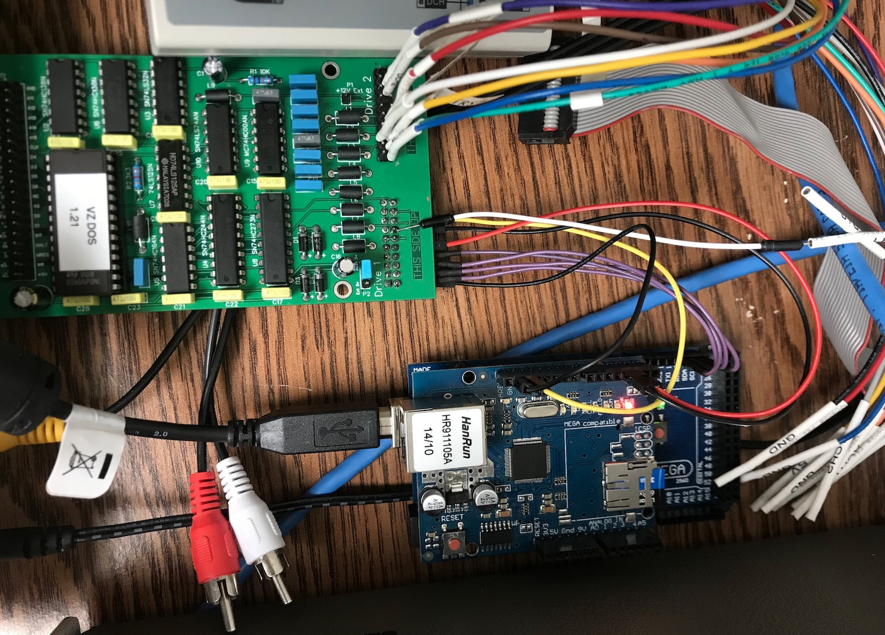

# dd20emu

This project is to create an Arduino UNO based Laser-200/310 DD20/DI40 Floppy drive interface and drive emulator.
At the moment this project is created, I only have a Laser-200 on hand, which has relative less amount of RAM (6K) on board. The design will include 16K (6264 SRAM x 2) memory expansion as well.

Devices I have:
* Laser 200, Basic version 1.1, 6KB RAM.
* Laser 310, Basic 2.0, 16K RAM.
* 16K RAM extension cartridge for Laser 200.
* 64K RAM extension cartridge for Laser 310.
* DD20 Floppy Drive

Todo list:
* Collect documents regarding DD20 interface and Disk image format.
* Design a 16K SRAM extension card to Laser 200
* I have about 2.25 hours length of Laser 310 data tape. They are Demo, Utilities, Games, Basic program I wrote etc. I would like to convert them to vz files. Giving they are 30 years old, the recorder I used back then was not a standard data recorder, there is only a little hope. [This link](http://www.pagetable.com/?p=32) describes how data tape encoding works on Apple I.

## Updates
2023-02-05
* Added serial terminal (Thanks https://github.com/dhansel/ArduinoFDC)
* Replaced LUT sector sync algorithm with a better one.
* Write protection

2022-02-14
Known issues:
* The emualtor is not stable when connected with DD20 floppy drive on the second port.
* Write is not supported yet.

2021-02/21  
Ported to Arduino Uno, latest code merged to develop branch.  
Used packed nibbles to store sec_lut value. 40x8 = 320 bytes.  
  

2021-02/15  
Default branch: develop  
Active feature branches:  
Feature/mega2560_using_int8_sector_lut  
Feature/arduino_uno_port  

2020-11/01  
Sector lut finished. Tested with hello.dsk disk image.  

2020-10-06  
First file loadded from Arduino DD20 emu.  

2020-09-27  
First time track#0 is emulated.  

2020-09-20  

2020-07-19  
This picture shows the RDData input is sent to 74LS164 A pin, and the D0 on port 11 read(FM Decoding). To get a byte, DI-40 needs to read from port 11 eight times.

This picture shows the how Y1(Port11) reads generates D CLR(Port 12) pulse, 74LS164 CLK pulse and Port 12 polling.

2019-02-10

Started working on VZ disk reading on raspberry pi zero w.  

2019-02-02  

Finally, I got some time I can get back to this project. My plan is to use the Laser31_FPGA GPIO to connect to one or two 74AC138 decoder to trigger Arduino UNO interrupt. Arduino UNO should have enough horse power to emulate DD20 floppy drive.  
These two screen shots are the IORQ /WR and /RD requests from [Laser310_FPGA](https://github.com/zzemu-cn/LASER310_FPGA) GPIO output, decoded by 74AC138 chip(Vcc 3.3v). Y1 is the output while Laser 310 runs the following 2 lines of code.  

~~~
10 out 1,1
20 goto 10
~~~

IORQ /RD  

  
IQRD /WR  

2018-09-06

Received VZ200 16K RAM Module purchased from eBay.
The 8 pin DIN socket on my Laser310 is actually RGB with composite Video output (Plus GND and PWR). There are SCART cables for SEGA Genesis 1 for that. I'm planning to purchase a SCART to RGBS (with LM1881 to split the Sync from Composite Video) from eBay.

[1200 Baud Archeology: Reconstructing Apple I BASIC from a Cassette Tape](https://www.pagetable.com/?p=32)

2017-03-29

[3ChipVZ](http://intertek00.customer.netspace.net.au/3ChipVZ/), Trying to recreate Laser200/310 with Teensy  

2017-03-01

With some patience, I manually decoded the Laser310 tape recording header in Audacity. Click on the images to see full pictures.Bit pulses are 1: three low/short pulses, 0: one low/short and one cycle of high/long pulses. 
Laser200/Laser310's cassette port operates at 600 bps Baud rate. This is a snapshot of the cassette waveforms found in VZ300 technical manual 

The chart above shows: 1.66ms/bit, which is 1000ms/1.66ms = 602.41bps. 0.277us/pulse, 50/50 duty cycle. 

It seems the Laser310 cassette program recording header is : 
0x80 - Leading bytes(many, about 3.61s, probably 252 bytes) 
0xFE - Sync bytes(5 bytes) 
0xF0 - File type : Basic, 0xF1 : Binary 
0xxx - File name (BUST OUT), up to 17 bytes 
0x00 - End of header, there is an extra *pause* after this byte  
0x7AE9 - Start Address, LSB first, MSB later 
...... 

Here is a [ASCII Chart](http://www.bluesock.org/~willg/dev/ascii.html)

2017-02-20

Created dd20emu project on github.

### Some useful links
[Teensy Z80](http://labs.domipheus.com/blog/teensy-z80-part-1-intro-memory-serial-io-and-display/) Teensy serves as peripheral and ROM. 
[DIY EEPROM programmer](http://danceswithferrets.org/geekblog/?p=496) Arduino Mega EEPROM programmer. 
[Quick and Dirty Parallel FLASH programmer](https://hackaday.io/project/6275-quick-and-dirty-parallel-flash-programmer) Use an Arduino Mega and minimal parts to programme parallel FLASH. 

